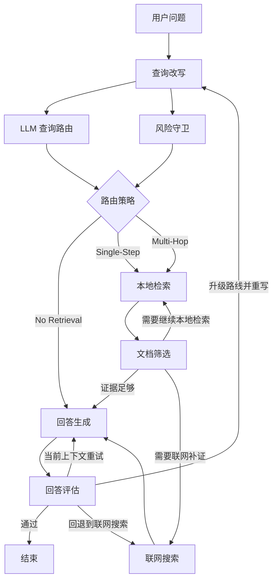

# 医学域自适应 RAG 系统框架说明、改造记录与简历点映射

## 1. 文档目标

这份文档有四个目的：

1. 把当前仓库从“原始 Agentic Adaptive RAG 演示仓库”到“医学域自适应 RAG 系统”的整体逻辑讲清楚。
2. 记录已经实施的改造内容、改造顺序、每一项改造的原因与价值。
3. 把你的简历表述逐条映射到仓库中的具体模块、脚本和工程边界。
4. 明确区分“框架级已经实现”与“真实实验数值还需要实跑”，保证后续写简历、答辩、面试时说法一致。

这不是一份简单的功能罗列文档，而是一份面向“项目讲解 + 研发延续 + 简历支撑”的总说明。

---

## 2. 项目定位

### 2.1 原始仓库的基础能力

原始 `Agentic Adaptive RAG` 仓库本身已经具备以下基础能力：

- 用 `LangGraph` 组织查询改写、检索、联网搜索、生成、评估、重试的闭环。
- 用 LLM 做路由、改写、文档判别、答案评估。
- 在检索不足时可以触发联网搜索，再回到生成阶段。

它的本质是一个“带自适应重试能力的智能体式 RAG 系统”。

### 2.2 本次改造后的目标系统

本次改造的目标，不是把它堆成一个更大的演示系统，而是把它演进为一个更贴近你简历描述的：

- `医学域自适应 RAG 系统`
- `保留 Query Router 三级动态分流机制`
- `以混合检索 + 重排层 + 风险守卫 + 多轮补证为核心`
- `具备查询塔 LoRA 训练闭环`
- `具备 MCP 兼容的工具接入边界`
- `具备版本化语料治理与标准化评测入口`

### 2.3 目标系统的核心特征

这个系统最关键的，不是“用了多少模块”，而是它把以下几层真正串起来了：

1. `策略层`
   - 查询路由器决定 `No Retrieval / Single-Step / Multi-Hop`
   - 风险路由层防止高风险医学问题走直答

2. `证据层`
   - 本地 ChromaDB + BM25 + BGE-M3 + RRF + BGE-M3 重排
   - HyDE 扩充短查询和模糊查询的召回空间
   - 本地语料不足时触发 Tavily + PubMed + 医学白名单搜索

3. `控制层`
   - LangGraph 状态持续记录路由、检索轮次、风险等级、路由历史、评估结果
   - 生成失败、证据不足、幻觉风险时触发升级与重试

4. `训练与评测层`
   - 查询塔 LoRA 的训练数据构造、训练、训练前后对比
   - 检索指标、路由升级率、生成指标、标准评测脚手架

一句话概括：

> 当前仓库已经不再是“检索一下再回答”的 RAG 演示项目，而是一个具有动态路由、医学安全边界、训练闭环和外部工具边界的医学域自适应 RAG 框架。

---

## 3. 相对原仓库的关键升级

为了后续答辩更清楚，先把“到底改了什么”总结成最核心的七条：

1. 从“固定先检索后生成”升级为 `LLM Query Router` 驱动的三级动态分流
2. 在原路由之上增加 `高风险医学问题禁止 No Retrieval 直答` 的风险守卫
3. 把 `Single-Step` 从“LLM 逐篇筛文档”改成“混合检索 + 重排层 + 少量 LLM”
4. 从演示语料升级到 `版本化语料管线`
5. 从抽象 MCP 客户端升级到 `抽象层 + 真实 stdio MCP 传输层`
6. 为 BGE-M3 查询塔补齐 `LoRA + InfoNCE + 训练前后基线对比闭环`
7. 为简历中提到的标准评测和质量评估补齐 `可运行脚手架`

这七条合在一起，才真正支撑“医学域自适应 RAG 系统”这个项目叙事。

---

## 4. 系统总体逻辑框架

### 4.1 主执行流程

当前图执行流程可以概括为：



### 4.2 图中的关键控制信息

`graph/state.py` 当前不仅保存最终答案，也保存过程级状态，用来驱动控制逻辑：

- `route_strategy`
- `forced_route_strategy`
- `route_rationale`
- `route_history`
- `risk_level`
- `risk_rationale`
- `risk_signals`
- `retrieval_queries`
- `sub_queries`
- `retrieval_round`
- `retry_count`
- `screening_mode`
- `evaluation`

这意味着系统不仅知道“答了什么”，还知道“为什么这么走、失败后怎么升级、升级了几次”。

### 4.3 当前系统与普通 RAG 的本质区别

普通 RAG 的思路通常是：

- 先检索
- 再生成
- 最多补一层简单评估

当前系统则是：

1. 先判断问题该走哪种成本层级
2. 再决定是否检索、本地检索几轮、是否联网补证
3. 最后根据事实依据充分性和回答质量决定是否升级路线

所以这个仓库真正的创新点不是单一模块，而是：

`路由 -> 证据 -> 评估 -> 升级 -> 再执行` 形成了闭环。

---

## 5. 三级动态路由机制

### 5.1 直答路线（No Retrieval）

#### 目标

- 让低风险、低复杂度、定义型或常识型问题以最低时延直接回答。

#### 典型问题

- 医学术语定义
- 一般概念解释
- 不涉及诊断、治疗、剂量、联用、急症、禁忌的低风险问法

#### 执行路径

- `rewrite_query`
- `question_router`
- 若判定为 `no_retrieval`，直接进入 `generate`
- `evaluate_generation` 若发现回答不充分，则升级为 `single_step`

#### 对应模块

- `graph/chains/router.py`
- `graph/nodes/rewrite_query.py`
- `graph/graph.py`
- `graph/nodes/generate.py`
- `graph/nodes/evaluate_generation.py`

#### 价值

- 这是系统“智能分流”的第一层，决定系统不是所有问题都走高成本检索。
- 对线上服务场景，它直接影响平均响应时延和成本。

### 5.2 单步检索路线（Single-Step）

#### 目标

- 用一轮高质量检索解决大部分简单事实型医学问题。
- 把更多问题拦截在低成本路径，不轻易升级到多跳推理路线。

#### 当前执行路径

1. `rewrite_query`
2. `retrieve`
3. `grade_documents`
4. `generate`
5. `evaluate_generation`

#### 当前单步检索路线的实现方式

现在的单步检索路线已经不是“召回一堆文档，再让 LLM 一篇篇看”，而是：

1. 改写后的查询进入本地检索
2. 必要时对首轮查询启用 HyDE
3. 通过 `BM25 + BGE-M3` 双路召回
4. 用 `RRF` 融合召回结果
5. 用 `BGE-M3 reranker` 对候选文档重排
6. 如果重排分数足够自信，则直接保留排序靠前的文档
7. 如果不够自信，再调用少量 LLM 做补充筛选

#### 对应模块

- `ingestion.py`
- `graph/embeddings/bge_m3.py`
- `graph/rerankers/bge_m3.py`
- `graph/nodes/retrieve.py`
- `graph/nodes/grade_documents.py`

#### 价值

- 这条路线承接了“简单事实问答”的主流流量。
- 查询塔 LoRA 的收益，最直接也最核心地体现在这条路线。
- 重排层加入后，单步检索路线的工程含义更接近“检索系统”而不是“LLM 大包大揽”。

### 5.3 多跳推理路线（Multi-Hop）

#### 目标

- 处理需要多源证据、补证、重试、联网搜索的复杂医学问题。

#### 典型问题

- 多药联用
- 综合诊疗方案
- 需要跨指南与文献交叉验证的问题
- 本地语料覆盖不足的问题

#### 执行路径

1. 首轮本地检索
2. `grade_documents` 评估是否证据不足
3. `gap_analyzer` 判断是再检索、本地扩展还是联网
4. `web_search` 通过 Tavily / PubMed / 医学白名单补证
5. `generate`
6. `evaluate_generation`
7. 若仍不足则重试或升级

#### 对应模块

- `graph/chains/gap_analyzer.py`
- `graph/nodes/retrieve.py`
- `graph/nodes/grade_documents.py`
- `graph/nodes/web_search.py`
- `graph/evaluation.py`
- `graph/nodes/evaluate_generation.py`

#### 价值

- 这条路线是系统可靠性的兜底路径。
- 它保证系统在遇到复杂问题时不是“检不到就硬答”，而是进入多轮补证闭环。

### 5.4 风险路由层

#### 设计动机

如果完全信任 LLM 路由器，医学场景会有一个明显问题：

- 有些高风险问题在语言形式上看起来很简单
- 但它们从业务安全角度不应该允许模型直答

例如：

- 药物联用
- 剂量
- 禁忌
- 诊断建议
- 特殊人群
- 急症症状

#### 当前实现

`graph/risk_guardrails.py` 会对问题文本做高风险信号检测，如果原始路由给出的是 `No Retrieval`，但命中了高风险医学信号，就会强制升级到至少 `Single-Step`。

#### 当前覆盖的风险信号

- `drug_interaction`
- `dosage_or_medication_plan`
- `diagnosis_or_treatment_decision`
- `special_population`
- `emergency_symptom`
- `high_stakes_drug`
- `multi_entity_medical_context`

#### 价值

- 这是整个系统医学安全边界的关键补丁。
- 它保留了 Query Router 的智能性，但不把安全决策完全交给路由模型本身。

### 5.5 路由升级逻辑

当前系统的升级逻辑非常重要，因为它决定了“系统是不是闭环”：

1. `No Retrieval -> Single-Step`
   - 直答后如果未回答问题，自动升级

2. `Single-Step -> Multi-Hop`
   - 如果证据支撑不够或问题未被覆盖，升级到多跳推理路线

3. `Multi-Hop -> Retry / Web Search`
   - 如果仍然不足，继续补证或重试

这部分逻辑主要在：

- `graph/nodes/evaluate_generation.py`
- `graph/nodes/rewrite_query.py`
- `graph/state.py`

---

## 6. 检索与证据层设计

### 6.1 混合检索栈

当前仓库检索层的核心组合是：

- `BM25` 负责关键词与术语匹配
- `BGE-M3` 负责语义召回
- `RRF` 负责融合稀疏与稠密结果
- `BGE-M3 reranker` 负责候选文档重排
- `LLM` 仅在重排不确定时补充筛选

这个设计比单纯的稠密检索更稳健，因为医学问答有两个特点：

1. 专有名词、缩写、药名、检查项非常多，关键词匹配依旧重要
2. 同一医学含义可能有多种问法，语义召回也不能少

### 6.2 HyDE 的作用

HyDE 当前主要用于处理以下查询：

- 很短的查询
- 描述不完整的查询
- 症状口语化表达
- 医学缩写或模糊问法

它的作用不是替代原始查询，而是额外生成一个“假设性文档表达”加入首轮检索，扩大召回空间。

对应模块：

- `graph/chains/hyde.py`
- `graph/nodes/retrieve.py`

### 6.3 重排层的工程意义

加入重排层后，单步检索路线的行为发生了明显变化：

- 之前更像“召回 -> LLM 广泛判别”
- 现在更像“召回 -> 机器排序 -> 少量 LLM 辅助”

它有两个直接收益：

1. 减少 LLM 在单步检索路线中的介入成本
2. 让查询塔 LoRA 的提升更容易体现在排序前部，而不是被后续 LLM 流程冲淡

对应模块：

- `graph/rerankers/bge_m3.py`
- `graph/nodes/retrieve.py`
- `graph/nodes/grade_documents.py`

### 6.4 证据上下文的结构化输入

`graph/nodes/generate.py` 当前会把检索到的证据组织成带元数据的上下文块，至少包含：

- `title`
- `source`
- `url`
- `rerank_score`

这样做的意义是：

- 让生成模型看到的不只是正文片段
- 也让后续做引用标注、来源策略、证据展示更容易继续演进

### 6.5 当前检索层的真实定位

目前这套栈已经足够支撑你简历中“混合检索 + 多层评估 + 自适应重试”的结构性表述。

但需要诚实说明：

- 结构已实现
- 真实基准评测数值仍需实跑

---

## 7. 外部搜索与 MCP 工具层

### 7.1 Tavily 作为统一网络搜索入口

当前仓库把联网搜索统一收敛到 Tavily API：

- 通用网页搜索：`search_web_general`
- 医学白名单搜索：`search_medical_web`
- PubMed 搜索：`search_pubmed`

对应模块：

- `graph/search/providers.py`
- `graph/mcp/registry.py`
- `graph/nodes/web_search.py`

### 7.2 医学域名白名单

当前白名单包括：

- `medlineplus.gov`
- `nih.gov`
- `ncbi.nlm.nih.gov`
- `pubmed.ncbi.nlm.nih.gov`
- `cdc.gov`
- `who.int`
- `mayoclinic.org`

价值在于：

- 医学问答不能把开放网页与权威医学来源混在一起
- 白名单是最简单、最实用、最能快速降低噪声的第一层治理

### 7.3 PubMed、医学网页、通用网页三类工具分层

这是一个非常重要但容易被忽略的设计点。

当前仓库不是只有一个“联网搜索”，而是把外部证据源分成三类：

1. `PubMed`
   - 更偏向文献与摘要

2. `医学网页`
   - 更偏向指南、患者教育、权威机构页面

3. `通用网页`
   - 作为最后兜底，不默认优先

这个分层的好处是：

- 后续可以做更细的来源策略
- 高风险问题可以优先依赖高可信来源
- 生成阶段更容易解释证据来源

### 7.4 MCP 抽象层与真实 stdio 传输层

当前 MCP 不是“只写了一个概念接口”，而是已经具备两层能力：

1. `In-process MCP client`
   - 默认可运行
   - 本地处理器直接注册工具

2. `真实 stdio MCP transport`
   - 可通过外部 MCP 服务接入远程工具
   - 通过环境变量注册命令、参数和工具别名

对应模块：

- `graph/mcp/client.py`
- `graph/mcp/registry.py`
- `graph/mcp/transports.py`
- `configs/mcp_stdio.example.env`

### 7.5 当前 MCP 的工程边界

当前 MCP 已经足够支持“项目亮点级”表述，但仍然属于第一版工程边界：

- 已实现：
  - 工具枚举
  - 工具调用
  - 别名映射
  - 进程内与 stdio 双模式共存

- 尚未完全强化：
  - 更丰富的模式校验
  - 更细的错误恢复策略
  - 流式传输管理
  - 复杂认证与会话复用

因此更准确的说法是：

> 当前仓库已经完成了 MCP 客户端抽象到真实 stdio MCP 传输层的工程落地，具备进一步扩展为统一工具接入层的基础。

---

## 8. 医学域化方案设计

这一部分是本项目从通用 RAG 走向“医学域系统”的核心。

### 8.1 语料设计

当前语料治理已经从“几条种子链接”升级为：

- `profile`
- `corpus_version`
- `manifest`
- `asset`
- `usage`

也就是“配置化 + 版本化 + 资产分层”的方式。

#### 当前语料配置

- `general_ai`
- `medical_demo`

其中 `medical_demo` 是当前默认的医学域语料配置。

#### 当前医学语料资产

当前 `data/corpus/medical_demo/v1/manifest.json` 中已经把资产拆成：

- `guideline_pages.jsonl`
- `pubmed_abstracts.jsonl`
- `nfcorpus_eval_registry.jsonl`

其中：

- `guideline_pages` 和 `pubmed_abstracts` 用于在线服务
- `nfcorpus_eval_registry` 用于离线评测

#### 为什么要这么拆

如果服务语料和评测语料混在一起，会带来两个问题：

1. 很难控制线上知识来源
2. 很难保证基准评测的可解释性

所以当前仓库已经明确把“提供答案的语料”和“用来评测的注册表”分开管理。

### 8.2 评测设计

当前评测体系被分成三层：

1. `检索层评测`
   - `BEIR nfcorpus`
   - 本地医学检索评测集模板

2. `路由层评测`
   - 路由升级评测集
   - 用来观察不同路径之间的升级率

3. `生成层评测`
   - 合成生成评测集
   - `ROUGE-L`
   - `BERTScore`

这样设计的意义是：

- 不把系统能力压缩成一个单一总分
- 能回答“提升到底来自检索、路由还是生成”

### 8.3 查询塔训练策略

这是当前最关键的医学域化训练方向。

#### 为什么训练查询塔

当前系统最容易出问题的地方，不一定是文档库本身，而是医学查询的表达形式：

- 症状口语化
- 缩写多
- 药名相近
- 疾病容易混淆
- 指标名和检查项表述不统一

也就是说，问题往往不是“没有正确文档”，而是“查询没有把正确文档拉到前面”。

#### 为什么先不训练文档塔

当前仓库优先选择只训练查询塔，原因有三点：

1. 文档向量已经入库到 ChromaDB，保持文档塔稳定更便于前后对照
2. 查询塔 LoRA 成本更低，实验闭环更清晰
3. 如果先训文档塔，会牵动重新建库、重新评测、变量更多，不利于解释收益来源

#### 为什么采用 LoRA

当前阶段优先用 LoRA，而不是更重的自适应方案，原因是：

1. 低成本
2. 易于增量试验
3. 不破坏现有主干流程
4. 更适合作为“第一轮可归因改造”

#### 当前训练目标

当前已明确采用：

- `InfoNCE 对比学习`
- 三元组输入格式

输入为：

- `query`
- `correct document`
- `confusable negative document`

输出为：

- `query embedding`
- `positive document embedding`
- `negative document embedding`

训练目标是：

- 让医学查询更贴近正确文档
- 与易混淆错误文档拉开距离

这与“医学域易混知识分离”的目标是完全一致的。

### 8.4 MCP 接入边界

MCP 在当前系统中承担的不是“核心推理算法”角色，而是“统一工具边界”角色。

对于医学域系统，它最适合承担三类工作：

1. 接入搜索工具
2. 接入文献服务或外部知识工具
3. 为未来的引用标注、知识服务、规则服务提供统一调用接口

当前不建议把 MCP 夸大为“系统智能性的来源”，更准确的说法是：

> MCP 让系统的外部能力调用方式更标准化、更可扩展，是工程结构升级，而不是替代路由与检索本身。

---

## 9. 改造路线图与已实施改造

这一节按实施顺序说明“为什么这样改”。

### 9.1 第一批改造：先补基础设施，不急着先训模型

这一阶段的目标是：

- 先让系统具备医学域落地的地基
- 先能回答“为什么要训、训什么、怎么评估”
- 而不是一上来就训练 BGEM3

#### 已做内容

1. 医学语料接入
   - `graph/corpus_profiles.py`
   - `graph/corpus_pipeline.py`
   - `data/corpus/medical_demo/v1/*`

2. MCP 客户端抽象层
   - `graph/mcp/client.py`
   - `graph/mcp/registry.py`

3. PubMed / 医学搜索工具接入
   - `graph/search/providers.py`
   - `graph/nodes/web_search.py`

4. 检索评测脚本骨架
   - `scripts/retrieval_eval.py`
   - `scripts/run_beir_nfcorpus_eval.py`
   - `scripts/evaluate_synthetic_generation.py`

#### 这样做的原因

- 如果没有语料、评测、工具边界，训练出来的模型也很难解释收益。
- 这一步先解决“系统是否能站住”的问题。

### 9.2 第二批改造：补查询塔 LoRA 训练闭环

这一阶段的目标是：

- 让查询塔训练变成一个可复现、可对照、可解释的实验链路

#### 已做内容

1. 训练数据构造脚本
   - `scripts/build_query_tower_training_data.py`

2. 训练脚本
   - `scripts/train_query_tower_lora.py`

3. 训练数据模板
   - `data/train/query_tower_seed_template.jsonl`
   - `data/train/query_tower_lora_template.jsonl`

4. 训练前基线对比
   - `scripts/retrieval_eval.py`
   - `scripts/compare_query_tower_baseline.py`

5. 路由升级率统计
   - `scripts/compute_route_upgrade_stats.py`
   - `scripts/compare_route_upgrade_baseline.py`

6. 统一训练前后总报告
   - `scripts/compare_training_before_after.py`

#### 这样做的原因

- 你后续必须能非常清楚地回答三个问题：
  - 为什么要训
  - 训前基线是多少
  - 提升来自哪里

如果没有这一整套闭环，这三个问题是答不稳的。

### 9.3 第三批改造：补高 ROI 的系统能力

这一阶段重点补的是“最能影响真实系统质量”的能力，而不是继续堆更多 agent。

#### 已做内容

1. 风险路由层
   - `graph/risk_guardrails.py`
   - `graph/nodes/rewrite_query.py`

2. 重排层
   - `graph/rerankers/bge_m3.py`
   - `graph/nodes/retrieve.py`
   - `graph/nodes/grade_documents.py`

3. 真实 stdio MCP 传输层
   - `graph/mcp/transports.py`
   - `configs/mcp_stdio.example.env`

4. 语料治理
   - `graph/corpus_profiles.py`
   - `graph/corpus_pipeline.py`
   - `data/corpus/medical_demo/v1/manifest.json`

#### 这样做的原因

- 风险路由层保证医疗安全边界
- 重排层直接改善首轮证据质量，投入产出比通常高于继续堆更多智能体
- 真实 MCP 传输层让“支持 MCP”从概念变成可落地的工程接口
- 语料治理让系统从演示数据走向可迭代数据资产

### 9.4 当前改造顺序的合理性

从工程视角看，这个顺序是合理的：

1. 先补系统地基
2. 再补训练闭环
3. 再补高 ROI 的质量增强层

这样做最大的好处是：

- 每一步都可解释
- 每一步都能对应到系统质量提升
- 每一步都能写进 git 历史

---

## 10. 查询塔 LoRA 的训练与评测闭环

这一节专门回答你最看重的三个问题。

### 10.1 为什么要训

当前系统在单步检索路线上，最值得优化的是查询对医学证据空间的对齐能力。

原因不是“BGE-M3 不够强”，而是医学查询的天然难点：

- 口语化症状
- 缩写
- 相似疾病
- 相似药物
- 检查项别名
- 多实体联合语境

这会导致问题虽然能被路由器判断成单步检索路线，但检索排序前列未必是最对的文档。

所以训练查询塔的目标非常明确：

> 让正确医学文档更容易被排到前面，从而减少单步检索失败后被迫升级到多跳推理路线的比例。

### 10.2 训练数据怎么构造

当前脚本 `scripts/build_query_tower_training_data.py` 的职责，是把“医学易混知识”变成可训练的三元组。

其核心思路是：

1. 从种子查询出发
2. 用当前检索器找到正例文档
3. 从最容易混淆的候选中挖掘困难负例
4. 输出 `(query, positive, confusable_negative)` 三元组

这种构造方式的意义很大：

- 负例不是随机负例
- 而是“当前系统最容易搞错的负例”
- 因此它直接对齐真实系统错误模式

### 10.3 训前基线是多少

当前仓库已经把“训前基线应该怎么测”落实成脚本：

- `scripts/retrieval_eval.py`
- `scripts/compare_query_tower_baseline.py`

可测指标包括：

- `Recall@5`
- `NDCG@10`
- `MRR@10`
- `hit@k`
- `top1_hit`

并且可以按 `query_type`、`expected_route_strategy` 等字段切片。

这意味着你可以单独回答：

- `Single-Step` 路线在训练前的召回与排序效果如何
- 哪类查询最弱
- 哪类查询最值得训练

### 10.4 提升来自哪里

当前仓库把“提升来自哪里”拆成三层证据：

1. `检索层`
   - `Recall@5 / NDCG@10 / MRR@10`

2. `样本层`
   - `recovered_from_miss`
   - `improved_top1`
   - `regressed_hit@k`

3. `路由层`
   - `No Retrieval -> Single-Step` 升级率
   - `Single-Step -> Multi-Hop` 升级率

对应脚本：

- `scripts/compare_query_tower_baseline.py`
- `scripts/compute_route_upgrade_stats.py`
- `scripts/compare_route_upgrade_baseline.py`
- `scripts/compare_training_before_after.py`

### 10.5 统一报告会输出什么

`scripts/compare_training_before_after.py` 会把以下内容汇总到同一份 JSON 报告：

- 单步检索路线的训练前后检索指标
- 直答路线升级到单步检索路线的比例
- 单步检索路线升级到多跳推理路线的比例
- 训练前后差值

所以它本质上是在回答：

1. 训练前基线是多少
2. 训练后变好了没有
3. 是检索变好了，还是路由升级率下降了

### 10.6 当前关于训练结果的诚实说法

当前已经具备：

- 训练数据构造
- 训练脚本
- 基线脚本
- 训练前后对比脚本
- 升级率统计脚本

但当前还没有在真实医学实验环境中跑出最终数值。

因此准确表述应该是：

> 查询塔 LoRA 的训练与评测闭环已经工程化落地，当前待补的是实跑结果，而不是方法本身。

---

## 11. 评测体系设计

### 11.1 检索阶段评测

当前检索阶段的评测分为两类：

1. `本地医学检索评测集`
   - 用于单步检索路线的核心训练前后对比

2. `BEIR nfcorpus`
   - 用于标准基准评测入口

对应模块：

- `scripts/retrieval_eval.py`
- `scripts/compare_query_tower_baseline.py`
- `scripts/run_beir_nfcorpus_eval.py`
- `graph/retrieval_metrics.py`
- `graph/retrieval_eval_utils.py`

### 11.2 路由阶段评测

当前路由阶段评测不是只看 router 初判，而是看真实执行后的升级情况。

对应模块：

- `data/eval/route_upgrade_eval_template.jsonl`
- `scripts/compute_route_upgrade_stats.py`
- `scripts/compare_route_upgrade_baseline.py`
- `graph/state.py`

这点很关键，因为它让“路由是否有效”从静态标签问题变成了真实执行问题。

### 11.3 生成阶段评测

当前生成阶段已补齐脚手架：

- `data/eval/synthetic_generation_eval_template.jsonl`
- `scripts/evaluate_synthetic_generation.py`
- `graph/generation_metrics.py`

指标包括：

- `ROUGE-L`
- `BERTScore`

### 11.4 真实性评测

当前系统优先使用：

- `RAGAS faithfulness`

若本地环境不满足 ragas 依赖，再退回到 LLM 评估器。

对应模块：

- `graph/evaluation.py`

### 11.5 评测体系的意义

这套评测体系解决的是一个经常被忽略的问题：

> 一个智能体式 RAG 项目不能只拿一个最终准确率来讲，因为你说不清提升到底来自哪一层。

当前仓库已经把这个问题拆清楚了：

- 检索层
- 路由层
- 生成层
- faithfulness 层

---

## 12. 简历点逐条映射

下面按“你希望在简历中讲的系统”逐条映射到仓库。

| 简历点 | 当前状态 | 对应模块 | 当前可怎么讲 |
| --- | --- | --- | --- |
| 基于 LLM 的 Query Router 动态路由机制 | 已实现 | `graph/chains/router.py` `graph/nodes/rewrite_query.py` `graph/graph.py` | 可以直接讲，且已保留三级动态分流 |
| 直答 / 单步检索 / 多跳推理三级分流 | 已实现 | `graph/graph.py` `graph/nodes/evaluate_generation.py` | 可以直接讲 |
| 高风险医学问题禁止直答 | 已实现 | `graph/risk_guardrails.py` | 可以直接讲，这是当前系统安全亮点之一 |
| 短查询或模糊查询使用 HyDE | 已实现 | `graph/chains/hyde.py` `graph/nodes/retrieve.py` | 可以直接讲 |
| 首轮混合检索：BM25 + BGE-M3 + RRF | 已实现 | `ingestion.py` `graph/embeddings/bge_m3.py` | 可以直接讲 |
| 单步检索路线采用重排层提升精排质量 | 已实现 | `graph/rerankers/bge_m3.py` `graph/nodes/retrieve.py` `graph/nodes/grade_documents.py` | 可以直接讲 |
| 单步检索从“LLM 全量筛文档”升级为“检索 + 重排层 + 少量 LLM” | 已实现 | `graph/nodes/grade_documents.py` | 可以直接讲，且很有工程价值 |
| 多跳推理闭环 | 已实现 | `graph/chains/gap_analyzer.py` `graph/nodes/web_search.py` `graph/nodes/evaluate_generation.py` | 可以直接讲 |
| Tavily API 网络搜索 | 已实现 | `graph/search/providers.py` | 可以直接讲 |
| PubMed / 医学网页 / 通用网页分层搜索 | 已实现 | `graph/search/providers.py` `graph/mcp/registry.py` | 可以直接讲 |
| 本地向量库使用 ChromaDB | 已实现 | `ingestion.py` | 可以直接讲 |
| RAGAS faithfulness 替代纯 LLM 自评 | 已实现 | `graph/evaluation.py` | 可以直接讲 |
| BGE-M3 查询塔 LoRA | 训练闭环已实现，实测结果待跑 | `scripts/train_query_tower_lora.py` `graph/embeddings/bge_m3.py` | 可以讲方法与闭环，数值需实跑后再写死 |
| BGE-M3 查询塔 LoRA 采用 InfoNCE 对比学习 | 已实现 | `scripts/train_query_tower_lora.py` `scripts/build_query_tower_training_data.py` | 可以直接讲 |
| 输入为 `(query, 正确文档, 易混淆错误文档)` | 已实现 | `data/train/query_tower_lora_template.jsonl` `scripts/build_query_tower_training_data.py` | 可以直接讲 |
| 训练前后基线对比 | 已实现 | `scripts/compare_query_tower_baseline.py` | 可以直接讲脚本闭环 |
| 单步检索路线的 Recall@5 / NDCG@10 / MRR@10 训练前后对比 | 已实现评测入口，结果待跑 | `scripts/compare_query_tower_baseline.py` | 可讲“支持统计”，不要编造数值 |
| 直答升级到单步检索的比例 | 已实现评测入口 | `scripts/compute_route_upgrade_stats.py` `scripts/compare_route_upgrade_baseline.py` | 可讲“支持统计” |
| 单步检索升级到多跳推理的比例 | 已实现评测入口 | `scripts/compute_route_upgrade_stats.py` `scripts/compare_route_upgrade_baseline.py` | 可讲“支持统计” |
| BEIR nfcorpus 基准评测 | 脚手架已实现，结果待跑 | `scripts/run_beir_nfcorpus_eval.py` | 可讲“已接入评测入口” |
| 合成测试集 + ROUGE-L + BERTScore | 脚手架已实现，结果待跑 | `scripts/evaluate_synthetic_generation.py` `graph/generation_metrics.py` | 可讲“已补齐评测框架” |
| MCP 协议接入 | 已实现第一版 | `graph/mcp/client.py` `graph/mcp/registry.py` `graph/mcp/transports.py` | 可以直接讲“支持 stdio MCP 传输层” |
| 版本化医学语料治理 | 已实现第一版 | `graph/corpus_profiles.py` `graph/corpus_pipeline.py` `data/corpus/medical_demo/v1/manifest.json` | 可以直接讲 |

### 12.1 当前可以非常稳地讲的内容

下面这些点已经不是“想法”，而是实打实落在代码里的内容：

- 三级动态路由
- 高风险医学问题禁止直答
- HyDE
- BM25 + BGE-M3 + RRF
- BGE-M3 重排层
- Tavily + PubMed + 医学白名单
- ChromaDB
- MCP stdio 传输层
- 版本化语料治理
- 查询塔 LoRA 的训练闭环

### 12.2 当前要诚实讲成“脚手架已就绪”的内容

下面这些点目前更适合说成“已实现评测入口，待实跑结果”：

- `BEIR nfcorpus` 的最终数值
- `Synthetic generation eval` 的最终数值
- `Query tower LoRA` 的真实训练提升数值

---

## 13. 当前模块地图

为了后续维护方便，这里按功能把核心文件再收一遍。

### 13.1 路由与改写

- `graph/chains/router.py`
- `graph/chains/query_rewriter.py`
- `graph/nodes/rewrite_query.py`
- `graph/risk_guardrails.py`
- `graph/state.py`
- `graph/graph.py`

### 13.2 检索与排序

- `ingestion.py`
- `graph/embeddings/bge_m3.py`
- `graph/rerankers/bge_m3.py`
- `graph/chains/hyde.py`
- `graph/nodes/retrieve.py`
- `graph/nodes/grade_documents.py`

### 13.3 生成与评估

- `graph/nodes/generate.py`
- `graph/evaluation.py`
- `graph/nodes/evaluate_generation.py`
- `graph/chains/hallucination_grader.py`
- `graph/chains/answer_grader.py`

### 13.4 搜索与 MCP

- `graph/search/providers.py`
- `graph/mcp/client.py`
- `graph/mcp/registry.py`
- `graph/mcp/transports.py`
- `graph/nodes/web_search.py`

### 13.5 语料与建库

- `graph/corpus_profiles.py`
- `graph/corpus_pipeline.py`
- `data/corpus/medical_demo/v1/manifest.json`
- `data/corpus/medical_demo/v1/guideline_pages.jsonl`
- `data/corpus/medical_demo/v1/pubmed_abstracts.jsonl`
- `data/corpus/medical_demo/v1/nfcorpus_eval_registry.jsonl`
- `ingestion.py`

### 13.6 训练与评测脚本

- `scripts/build_query_tower_training_data.py`
- `scripts/train_query_tower_lora.py`
- `scripts/retrieval_eval.py`
- `scripts/compare_query_tower_baseline.py`
- `scripts/compute_route_upgrade_stats.py`
- `scripts/compare_route_upgrade_baseline.py`
- `scripts/compare_training_before_after.py`
- `scripts/run_beir_nfcorpus_eval.py`
- `scripts/evaluate_synthetic_generation.py`
- `scripts/describe_corpus_manifest.py`

---

## 14. 如何实际使用当前闭环

这一节是“如果接下来要实跑实验，应该怎么走”。

### 14.1 建库

先准备语料配置，并运行：

```bash
python ingestion.py
```

作用：

- 把当前 `medical_demo` 语料配置的在线服务语料建入 ChromaDB

### 14.2 查看语料清单

```bash
python scripts/describe_corpus_manifest.py --profile medical_demo
```

作用：

- 确认当前语料版本、资产路径、在线服务与离线评测分层是否正确

### 14.3 训练前检索基线

```bash
python scripts/retrieval_eval.py --dataset data/eval/medical_retrieval_eval_template.jsonl
```

作用：

- 拿到当前单步检索路线的基线

### 14.4 构造查询塔训练数据

```bash
python scripts/build_query_tower_training_data.py
```

作用：

- 从种子查询和当前语料中构造三元组训练样本

### 14.5 训练查询塔 LoRA

```bash
python scripts/train_query_tower_lora.py --config configs/query_tower_lora.example.json
```

作用：

- 基于 InfoNCE 三元组训练查询塔适配器

### 14.6 训练前后对比

```bash
python scripts/compare_query_tower_baseline.py --dataset data/eval/medical_retrieval_eval_template.jsonl --adapter-path <adapter_dir>
```

作用：

- 对比查询塔微调前后的 `Recall@5 / NDCG@10 / MRR@10`

### 14.7 路由升级率对比

```bash
python scripts/compare_route_upgrade_baseline.py --dataset data/eval/route_upgrade_eval_template.jsonl --adapter-path <adapter_dir>
```

作用：

- 统计 `No Retrieval -> Single-Step`
- 统计 `Single-Step -> Multi-Hop`

### 14.8 统一总报告

```bash
python scripts/compare_training_before_after.py --retrieval-dataset data/eval/medical_retrieval_eval_template.jsonl --routing-dataset data/eval/route_upgrade_eval_template.jsonl --adapter-path <adapter_dir>
```

作用：

- 用一份报告回答“为什么要训、基线是多少、提升来自哪里”

---

## 15. 当前边界与诚实结论

### 15.1 当前已经完成的事情

从工程结构上看，当前仓库已经基本完成了你简历目标系统的大部分骨架：

1. 路由层
2. 医学风险守卫
3. 混合检索
4. HyDE
5. 重排层
6. 自适应重试
7. Tavily + PubMed + 医学白名单
8. MCP 传输层
9. 版本化语料
10. 查询塔 LoRA 闭环
11. 检索/路由/生成评测入口

### 15.2 当前还没有完成的事情

下面这些内容不应该在没有实跑的前提下写成确定数值：

1. `BEIR nfcorpus` 真实分数
2. `Synthetic generation` 真实 `ROUGE-L / BERTScore`
3. `Query tower LoRA` 真实训练后提升

### 15.3 当前最准确的项目结论

当前最准确、最稳妥的总述应该是：

> 这个仓库已经从原始 Agentic Adaptive RAG 演进为一个医学域自适应 RAG 框架。系统保留了 Query Router 的三级动态路由机制，并在此基础上补充了医学风险守卫、混合检索、HyDE、BGE-M3 重排层、Tavily / PubMed 外部补证、MCP stdio 传输层、版本化语料治理，以及 BGE-M3 查询塔 LoRA 的训练与评测闭环。当前框架级能力已基本落地，下一步主要是补齐真实基准评测和训练结果数值。

---

## 16. 还值得继续精进的方向

如果后续继续往“更强的可展示版本”推进，建议优先级如下：

### 16.1 引用标注机制

当前生成上下文已经带有标题、来源、URL、重排分数，但还没有把答案输出成真正的引用标注风格。

这一步很值得做，因为它会直接提升：

- 可信感
- 面试展示效果
- 高风险医学问题的可解释性

### 16.2 医学缩写扩展模块

当前虽然有 HyDE，但还没有单独的医学缩写扩展层。

对于医学查询来说，这会是一个很高投入产出比的增强点。

### 16.3 交叉编码器重排器

当前重排层是 BGE-M3 双编码器风格重排。

后续如果想继续提高精排质量，可以引入交叉编码器作为更强但更贵的后处理层。

### 16.4 更强的 MCP 治理

当前已有 stdio 传输层，但还可以继续补：

- 工具模式约束
- 更细错误恢复
- 认证与会话管理
- 统一工具能力目录

### 16.5 真实实验运行与结果归档

从“项目成型”走向“简历封版”，最关键的一步已经不是再写代码，而是：

- 跑真实训练
- 跑真实基准评测
- 归档训练前后报告
- 固化最终结果表述

---

## 17. 当前验证状态

截至目前，本仓库已经完成的验证包括：

1. `python -m compileall graph scripts ingestion.py model.py`
2. `scripts/describe_corpus_manifest.py` 可运行
3. 训练前后对比脚本的命令行入口可用
4. 风险守卫逻辑已做基础冒烟检查

当前还没有完成的验证包括：

1. 真正下载并运行 BGE-M3 相关模型后的完整实验
2. Tavily API 的联网真实搜索结果
3. BEIR nfcorpus 的真实基准评测
4. Query tower LoRA 的真实训练与结果收集

---

## 18. 最后总结

如果把当前仓库放到一句话里概括，它已经可以被定义为：

> 一个基于 LangGraph 的医学域自适应 RAG 系统，保留 Query Router 的三级动态分流结构，通过 HyDE、混合检索、BGE-M3 重排层、风险路由、联网补证与多轮评估重试形成闭环，并进一步补齐了查询塔 LoRA、MCP stdio 传输层、版本化语料治理和训练前后评测闭环。

如果把它放到“简历是否站得住”的角度总结，则更准确的说法是：

- `系统框架和模块能力`：已经基本站住
- `训练与基准评测方法论`：已经站住
- `真实实验数值`：下一步需要实跑补齐

这也是当前最诚实、最有说服力、最适合继续往下推进的状态。
